# 系统实现总结报告

[TOC]

在本次数据库理论课程设计中，我们小组实现了一个类似`Bilibili`的社区型视频网站数据库系统，以下将详细介绍其实现过程。


## 一、 实现环境（`Vuetify`+`SpringBoot` + `MySQL`）

我们本次课程设计实现的项目为一类似`Bilibili`的社区网站系统，其构建与实现依赖于`Vuetify`与`Spring Boot` 的结构框架以及 `MySQL`数据库；以及为了提高系统的实用性，还基于`Nginx`搭建了一个图片视频服务器。

整个系统的大致结构为：用户通过浏览器向前端服务器请求页面内容，前端服务器返回基于`Vue.js`编写的网页结构、静态内容及脚本；浏览器再通过执行脚本向后端服务器发出获取数据的请求，后端收到请求后，对 `MySQL`数据库进行增删改查。

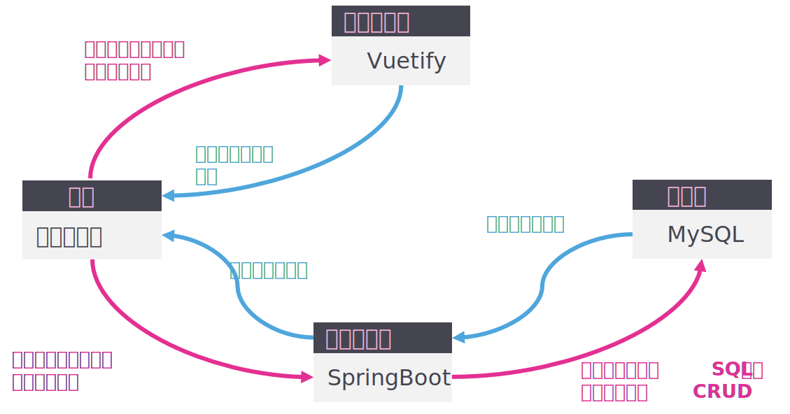

----

### 1、 `Vue`前端环境

`Vue`是一套构建用户界面的渐进式框架，其只关注视图层，采用的是自底向上的增量开发式设计，使用时需掌握`HTML`、`CSS`以及`JavaScript`的相关知识，适合在本次实验作业中使用。

因此在前端的项目开发中，我们根据实际情况不同程度地使用了`Vue`，利用了`Vue CLI`脚手架搭建出了前端的框架内容。

而安装脚手架的步骤大致如下：

- 首先登陆官网```https://nodejs.org/en/```安装`Node.js`以使用`npm`
- 执行`npm -g install npm`将`npm`升至最新版本
- 执行`npm install -g vue-cli`安装`vue-cli`脚手架。
- 进入项目文件夹，执行`vue init webpack prject_name`完成项目的创建。

创建得到的项目目录如下：

```
./my_theme/
|-- README.md
|-- babel.config.js
|-- node_modules
|-- package-lock.json
|-- package.json
|-- public
|-- src
|-- vue.config.js
`-- yarn.lock

3 directories, 6 files
```

### 2、 `SpringBoot`后端环境

`Spring`框架是基于`JAVA`的一种开源应用框架，提供具有反转特性的容器，深受大众青睐。而`SpringBoot`基于`Spring`的设计，继承了`Spring`框架原有的优秀特性，并通过简化配置从而完成了对原有`Spring`应用的搭建与开发过程的进一步简化。使用`SpringBoot`可以便捷地与前端进行交互，并与数据库进行配合。

因此，我们选择使用`IntelliJ IDEA`作为集成开发环境，实现`SpringBoot`的后端服务器。

后端`SpringBoot`项目创建过程如下：

- 访问[https://start.spring.io/](https://start.spring.io/)，快速创建新项目，并下载该压缩包；
- 解压后，使用IDEA将该目录作为maven项目导入即可。

### 3、 `MySQL`数据库环境

`MySQL` 是当下最流行的关系型数据库管理系统之一，且在 `WEB` 应用方面，`MySQL`也同样功能强大。且与`SQL Server`相比，其体积更小、速度更快，更适合小型项目的开发。

由于本项目为小组多人同时开发，为了便于调试，我们将`MySQL`部署在远程的`Linux Ubuntu`服务器上，通过SSH建立与服务器的连接，并进行数据库的安装和配置。

至于`MySQL`的下载安装较为简单，以下不予赘述。下图为使用`Putty`通过SSH连接服务器后访问MySQL数据库的结果。

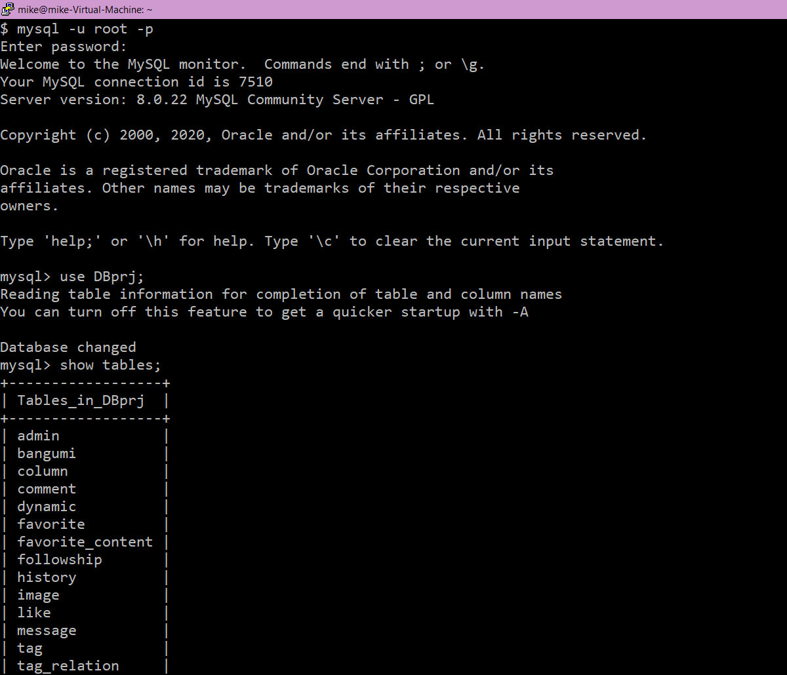


## 二、 系统功能结构图

### 1、 系统功能结构

本次作业设计是一个类`Bilibili`的社区网站系统，因此需要实现的功能主要分为用户身份验证管理功能、用户个人信息管理功能、用户私信功能、作品上传功能、管理员删除功能等等。而用户身份验证管理功能以下又有用户注册功能、用户登录功能、管理员登录功能；至于用户个人信息管理功能，其以下有用户关注功能、用户收藏功能、用户点赞功能、用户观看记录功能；而用户私信功能需要有用户收发私信的具体功能；作品上传功能中有用户上传功能（上传视频、专栏、动态、评论）和管理员上传番剧功能；至于管理员的删除功能，系统设置管理员有“无限”权力，可以删除社区网站系统中的五大主要实体（视频、番剧、动态、专栏、评论）。

整体功能结构及某些功能的细分具体如下图：


----

### 2、 系统的数据流分析

根据以上的系统功能分析，得到大致的功能实现流程，而实现流程中的数据流走向如下：

首先是全局的数据流分析：


一层数据流分析：


二层数据流分析如下，分别为用户账号验证系统数据流图、用户个人信息系统数据流图、上传作品系统数据流图以及删除作品系统数据流图（用户私信系统较为简单，一层数据流图的说明已足够完整）：


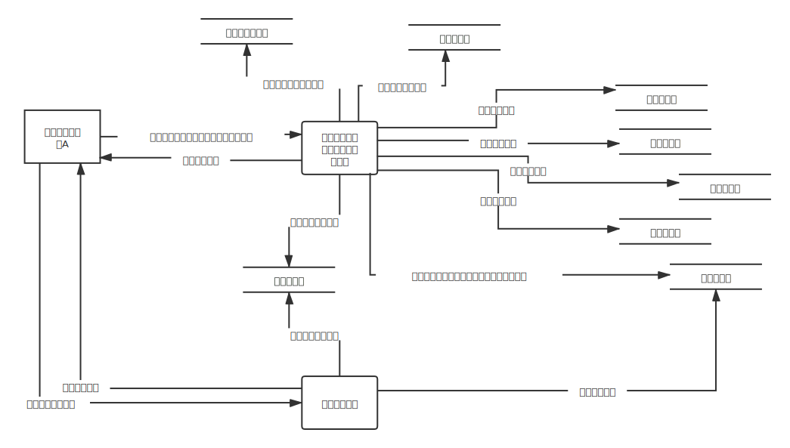

---


## 三、 基本表的定义，主外码等完整性约束定义，索引的定义

### 1、 基本表的定义、主外码的完整性约束

本次课程设计专业中一共设计了16张表格，其分别为：用户表、视频表、专栏表、动态表、收藏夹表、图片表、评论表、标签表、管理员表、私信表、番剧表，以及标签联系表、历史记录表、关注表、收藏内容表、点赞表。

所有表的具体定义，主外码等完整性约束定义如下：

| 用户表：user |              |           |      |
| ------------ | ------------ | --------- | ---- |
| 属性名       | attribute    | 类型      | 备注 |
| 用户id       | user_id      | INT       | 主码 |
| 注册时间     | sign_up_date | TIMESTAMP |      |
| 电子邮箱     | email        | VARCHAR   |      |
| 手机号码     | phone_number | CHAR(11)  |      |
| 登录名       | user_name    | VARCHAR   | 唯一 |
| 等级         | user_level   | INT       |      |
| 当前状态     | user_state   | INT       |      |
| 昵称         | nickname     | VARCHAR   |      |
| 密码         | password     | VARCHAR   | 非空 |

| 图片表：image |                   |           |             |
| ------------- | ----------------- | --------- | ----------- |
| 属性名        | attribute         | 类型      | 备注        |
| 图片id        | image_id          | INT       | 主码        |
| 发布时间      | image_upload_date | TIMESTAMP |             |
| 发布用户id    | image_uploader_id | INT       | user_id外键 |
| 图片url       | image_url         | VARCHAR   |             |
| 图片名        | image_name        | VARCHAR   |             |

| 收藏夹表：favorite |                     |         |             |
| ------------------ | ------------------- | ------- | ----------- |
| 属性名             | attribute           | 类型    | 备注        |
| 收藏夹id           | favorite_id         | INT     | 主码        |
| 名称               | favorite_name       | VARCHAR |             |
| 访问权限           | favorite_permission | INT     |             |
| 所属用户id         | favorite_owner_id   | INT     | user_id外键 |

| 视频表：video |                    |           |              |
| ------------- | ------------------ | --------- | ------------ |
| 属性名        | attribute          | 类型      | 备注         |
| 视频id        | video_id           | INT       | 主码         |
| 发布时间      | video_upload_date  | TIMESTAMP |              |
| 时长          | video_duration     | TIME      |              |
| 名称          | video_name         | VARCHAR   |              |
| 播放量        | video_play_times   | INT       |              |
| 视频内容      | video_content_url  | VARCHAR   |              |
| 封面图片id    | video_image_id     | INT       | image_id外键 |
| 发布用户id    | video_uploader_id  | INT       | user_id外键  |
| 视频简介      | video_description  | TEXT      |              |
| 点赞数        | video_like_numbers | INT       |              |

| 动态表：dynamic |                      |           |              |
| --------------- | -------------------- | --------- | ------------ |
| 属性名          | attribute            | 类型      | 备注         |
| 动态id          | dynamic_id           | INT       | 主码         |
| 发布时间        | dynamic_upload_date  | TIMESTAMP |              |
| 浏览量          | dynamic_read_times   | INT       |              |
| 动态内容        | dynamic_content      | TEXT      |              |
| 访问权限        | dynamic_permission   | INT       |              |
| 发布用户id      | dynamic_uploader_id  | INT       | user_id外键  |
| 封面图片id      | dynamic_image_id     | INT       | image_id外键 |
| 点赞数          | dynamic_like_numbers | INT       |              |

| 管理员表：admin |                  |         |                   |
| --------------- | ---------------- | ------- | ----------------- |
| 属性名          | attribute        | 类型    | 备注              |
| 管理员id        | admin_id         | INT     | user_id外键，主码 |
| 昵称            | admin_name       | VARCHAR |                   |
| 权限            | admin_permission | INT     |                   |

| 私信表：message |                     |           |             |
| --------------- | ------------------- | --------- | ----------- |
| 属性名          | attribute           | 类型      | 备注        |
| 私信id          | message_id          | INT       | 主码        |
| 私信内容        | message_content     | TEXT      |             |
| 发送时间        | message_send_date   | TIMESTAMP |             |
| 发送用户id      | message_sender_id   | INT       | user_id外键 |
| 接受用户id      | message_receiver_id | INT       | user_id外键 |

| 番剧表：bangumi |                      |           |              |
| --------------- | -------------------- | --------- | ------------ |
| 属性名          | attribute            | 类型      | 备注         |
| 番剧id          | bangumi_id           | INT       | 主码         |
| 番剧名称        | bangumi_name         | VARCHAR   |              |
| 发布时间        | bangumi_upload_date  | TIMESTAMP |              |
| 播放量          | bangumi_play_times   | INT       |              |
| 番剧内容url     | bangumi_content_url  | VARCHAR   |              |
| 发布管理员id    | bangumi_uploader_id  | INT       | admin_id外键 |
| 番剧简介        | bangumi_description  | TEXT      |              |
| 番剧类别        | bangumi_category     | VARCHAR   |              |
| 番剧封面ID      | bangumi_image_id     | INT       | image_id外键 |
| 点赞数          | bangumi_like_numbers | INT       |              |

| 标签表：tag |           |         |      |
| ----------- | --------- | ------- | ---- |
| 属性名      | attribute | 类型    | 备注 |
| 标签id      | tag_id    | INT     | 主码 |
| 标签名      | tag_name  | VARCHAR |      |

| 专栏表：column |                     |           |              |
| -------------- | ------------------- | --------- | ------------ |
| 属性名         | attribute           | 类型      | 备注         |
| 专栏id         | column_id           | INT       | 主码         |
| 发布时间       | column_upload_date  | TIMESTAMP |              |
| 标题           | column_name         | VARCHAR   |              |
| 浏览量         | column_read_times   | INT       |              |
| 专栏内容       | column_content      | TEXT      |              |
| 发布用户id     | column_uploader_id  | INT       | user_id外键  |
| 封面图片id     | column_image_id     | INT       | image_id外键 |
| 点赞数         | column_like_numbers | INT       |              |

| 评论表：comment |                      |           |                |
| --------------- | -------------------- | --------- | -------------- |
| 属性名          | attribute            | 类型      | 备注           |
| 评论id          | comment_id           | INT       |                |
| 发布时间        | comment_sendDate     | TIMESTAMP |                |
| 内容            | comment_content      | TEXT      |                |
| 评论对象类型    | commented_type       | INT       |                |
| 发布用户id      | comment_sender_id    | INT       | user_id外键    |
| 番剧对象id      | commented_bangumi_id | INT       | bangumi_id外键 |
| 视频对象id      | commented_video_id   | INT       | video_id外键   |
| 动态对象id      | commented_dynamic_id | INT       | dynamic_id外键 |
| 专栏对象id      | commented_column_id  | INT       | column_id外键  |
| 点赞数          | comment_like_numbers | INT       |                |

----

| 收藏内容表：favorite_content |                   |           |                 |
| ---------------------------- | ----------------- | --------- | --------------- |
| 属性名                       | attribute         | 类型      | 备注            |
| 收藏内容id                   | fc_id             | INT       | 主码            |
| 收藏对象类型                 | fc_type           | INT       |                 |
| 收藏时间                     | fc_collected_date | TIMESTAMP |                 |
| 收藏夹id                     | fc_owner_id       | INT       | favorite_id外键 |
| 专栏对象id                   | fc_column_id      | INT       | column_id外键   |
| 番剧对象id                   | fc_bangumi_id     | INT       | bangumi_id外键  |
| 视频对象id                   | fc_video_id       | INT       | video_id外键    |

| 标签联系表：tag_relation |                   |      |                |
| ------------------------ | ----------------- | ---- | -------------- |
| 属性名                   | attribute         | 类型 | 备注           |
| 联系id                   | tagRelation_id    | INT  | 主码           |
| 被标签对象类型           | tagged_type       | INT  |                |
| 标签id                   | Tag_id            | INT  | tag_id外键     |
| 专栏对象id               | tagged_columnid   | INT  | column_id外键  |
| 番剧对象id               | tagged_bangumi_id | INT  | bangumi_id外键 |
| 视频对象id               | tagged_video_id   | INT  | video_id外键   |
| 动态对象id               | tagged_dynamic_id | INT  | dynamic_id外键 |

| 关注表：followship |               |           |             |
| ------------------ | ------------- | --------- | ----------- |
| 属性名             | attribute     | 类型      | 备注        |
| 关注id             | followship_id | INT       | 主码        |
| 关注用户id         | following_id  | INT       | user_id外键 |
| 被关注用户id       | follower_id   | INT       | user_id外键 |
| 关注时间           | follow_date   | TIMESTAMP |             |

| 点赞表：like |                  |           |                |
| ------------ | ---------------- | --------- | -------------- |
| 属性名       | attribute        | 类型      | 备注           |
| 点赞记录id   | like_id          | INT       | 主码           |
| 点赞用户id   | liker_id         | INT       | user_id外键    |
| 点赞对象类型 | liked_type       | INT       |                |
| 点赞时间     | like_date        | TIMESTAMP |                |
| 专栏对象id   | liked_column_id  | INT       | column_id外键  |
| 番剧对象id   | liked_bangumi_id | INT       | bangumi_id外键 |
| 视频对象id   | liked_video_id   | INT       | video_id外键   |
| 动态对象id   | liked_dynamic_id | INT       | dynamic_id外键 |
| 评论对象id   | liked_comment_id | INT       | comment_id外键 |

| 历史记录：history |                    |           |                |
| ----------------- | ------------------ | --------- | -------------- |
| 属性名            | attribute          | 类型      | 备注           |
| 历史记录id        | history_id         | INT       | 主码           |
| 观看时间          | watch_date         | TIMESTAMP |                |
| 观看用户id        | watcher_id         | INT       | user_id外键    |
| 观看目标类型      | watched_type       | INT       |                |
| 专栏对象id        | watched_column_id  | INT       | column_id外键  |
| 番剧对象id        | watched_bangumi_id | INT       | bangumi_id外键 |
| 视频对象id        | watched_video_id   | INT       | video_id外键   |

主外码的完整性约束条件如上，至于其他的完整性约束大多由后端进行判断处理。


### 2、 索引的使用

在以上所有基本表中，我们可以为所有的外键属性定义一个索引，方便之后的选择查找与连接等操作。

对于类似用户表的登录名`username`属性，其拥有唯一的特性，因此我们也可以为它建立一个索引，方便查找。

具体的实现可见之后的具体生成命令。


### 3、 生成基本表的`SQL`命令

根据以上部分的介绍，可以得出如下的`SQL`建表指令（表格建在`DBprj`数据库中）。具体可参见数据库导出的`dump.sql`文件。

- 下列表分别对应实体概念。

```mysql
CREATE TABLE `DBprj`.`user` (
  `user_id` INT NOT NULL AUTO_INCREMENT,
  `username` VARCHAR(45) NOT NULL,
  `nickname` VARCHAR(45) NOT NULL,
  `password` VARCHAR(45) NOT NULL,
  `sign_up_date` TIMESTAMP NULL DEFAULT CURRENT_TIMESTAMP,
  `email` VARCHAR(45) NULL,
  `phone_number` CHAR(11) NULL,
  `user_level` INT NULL,
  `user_state` INT NULL,
  PRIMARY KEY (`user_id`),
  UNIQUE INDEX `user_name_UNIQUE` (`user_name` ASC) VISIBLE);
  
CREATE TABLE `DBprj`.`image` (
  `image_id` INT NOT NULL AUTO_INCREMENT,
  `image_name` VARCHAR(45),
  `image_upload_date` TIMESTAMP NULL DEFAULT CURRENT_TIMESTAMP,
  `image_uploader_id` INT NULL,
  `image_url` VARCHAR(512) NULL,
  PRIMARY KEY (`image_id`),
  INDEX `image_uploader_id_user_id_idx` (`image_uploader_id` ASC) VISIBLE,
  CONSTRAINT `image_uploader_id_user_id`
    FOREIGN KEY (`image_uploader_id`)
    REFERENCES `DBprj`.`user` (`user_id`)
    ON DELETE CASCADE
    ON UPDATE CASCADE);
  
CREATE TABLE `DBprj`.`message` (
  `message_id` INT NOT NULL AUTO_INCREMENT,
  `message_content` TEXT NULL,
  `message_send_date` TIMESTAMP NULL DEFAULT CURRENT_TIMESTAMP,
  `message_sender_id` INT NULL,
  `message_receiver_id` INT NULL,
  PRIMARY KEY (`message_id`),
  INDEX `message_sender_id_user_id_idx` (`message_sender_id` ASC) VISIBLE,
  INDEX `message_receiver_id_user_id_idx` (`message_receiver_id` ASC) VISIBLE,
  CONSTRAINT `message_sender_id_user_id`
    FOREIGN KEY (`message_sender_id`)
    REFERENCES `DBprj`.`user` (`user_id`)
    ON DELETE CASCADE
    ON UPDATE CASCADE,
  CONSTRAINT `message_receiver_id_user_id`
    FOREIGN KEY (`message_receiver_id`)
    REFERENCES `DBprj`.`user` (`user_id`)
    ON DELETE CASCADE
    ON UPDATE CASCADE);

CREATE TABLE `DBprj`.`column` (
  `column_id` INT NOT NULL AUTO_INCREMENT,
  `column_upload_date` TIMESTAMP NULL DEFAULT CURRENT_TIMESTAMP,
  `column_name` VARCHAR(45) NULL,
  `column_read_times` INT NULL,
  `column_content` TEXT NULL,
  `column_uploader_id` INT NULL,
  `column_image_id` INT NULL,
  `column_like_numbers` INT NULL,
  PRIMARY KEY (`column_id`),
  INDEX `column_uploader_id_user_id_idx` (`column_uploader_id` ASC) VISIBLE,
  INDEX `column_image_id_image_id_idx` (`column_image_id` ASC) VISIBLE,
  CONSTRAINT `column_uploader_id_user_id`
    FOREIGN KEY (`column_uploader_id`)
    REFERENCES `DBprj`.`user` (`user_id`)
    ON DELETE CASCADE
    ON UPDATE CASCADE,
  CONSTRAINT `column_image_id_image_id`
    FOREIGN KEY (`column_image_id`)
    REFERENCES `DBprj`.`image` (`image_id`)
    ON DELETE SET NULL
    ON UPDATE SET NULL);
    
CREATE TABLE `DBprj`.`admin` (
  `admin_id` INT NOT NULL,
  `admin_name` VARCHAR(45) NULL,
  `admin_permission` INT NULL,
  PRIMARY KEY (`admin_id`),
  CONSTRAINT `admin_id_user_id`
    FOREIGN KEY (`admin_id`)
    REFERENCES `DBprj`.`user` (`user_id`)
    ON DELETE CASCADE
    ON UPDATE CASCADE);
    
CREATE TABLE `DBprj`.`tag` (
  `tag_id` INT NOT NULL AUTO_INCREMENT,
  `tag_name` VARCHAR(45) NOT NULL,
  PRIMARY KEY (`tag_id`));
  
CREATE TABLE `DBprj`.`bangumi` (
  `bangumi_id` INT NOT NULL AUTO_INCREMENT,
  `bangumi_name` VARCHAR(100) NULL,
  `bangumi_upload_date` TIMESTAMP NULL DEFAULT CURRENT_TIMESTAMP,
  `bangumi_play_times` INT NULL,
  `bangumi_content_url` VARCHAR(512) NULL,
  `bangumi_uploader_id` INT NULL,
  `bangumi_description` TEXT NULL,
  `bangumi_category` VARCHAR(45) NULL,
  `bangumi_image_id` INT NULL,
  `bangumi_like_numbers` INT NULL,
  PRIMARY KEY (`bangumi_id`),
  INDEX `bangumi_uploader_id_admin_id_idx` (`bangumi_uploader_id` ASC) VISIBLE,
  INDEX `bangumi_image_id_image_id_idx` (`bangumi_image_id` ASC) VISIBLE,
  CONSTRAINT `bangumi_uploader_id_admin_id`
    FOREIGN KEY (`bangumi_uploader_id`)
    REFERENCES `DBprj`.`admin` (`admin_id`)
    ON DELETE CASCADE
    ON UPDATE CASCADE,
  CONSTRAINT `bangumi_image_id_image_id`
  	FOREIGN KEY (`bangumi_image_id`)
  	REFERENCES `DBprj`.`image` (`image_id`)
  	ON DELETE SET NULL
  	ON UPDATE SET NULL);
    
CREATE TABLE `DBprj`.`favorite` (
  `favorite_id` INT NOT NULL AUTO_INCREMENT,
  `favorite_name` VARCHAR(45) NULL,
  `favorite_permission` INT NULL,
  `favorite_owner_id` INT NULL,
  PRIMARY KEY (`favorite_id`),
  INDEX `favorite_owner_id_user_id_idx` (`favorite_owner_id` ASC) VISIBLE,
  CONSTRAINT `favorite_owner_id_user_id`
    FOREIGN KEY (`favorite_owner_id`)
    REFERENCES `DBprj`.`user` (`user_id`)
    ON DELETE CASCADE
    ON UPDATE CASCADE);    
    
CREATE TABLE `DBprj`.`video` (
  `video_id` INT NOT NULL AUTO_INCREMENT,
  `video_upload_date` TIMESTAMP NULL DEFAULT CURRENT_TIMESTAMP,
  `video_duration` TIME NULL,
  `video_name` VARCHAR(45) NULL,
  `video_play_times` INT NULL,
  `video_content_url` VARCHAR(512) NULL,
  `video_image_id` INT NULL,
  `video_uploader_id` INT NULL,
  `video_description` TEXT NULL,
  `video_like_numbers` INT NULL,
  PRIMARY KEY (`video_id`),
  INDEX `video_image_id_image_id_idx` (`video_image_id` ASC) VISIBLE,
  INDEX `video_uploader_id_user_id_idx` (`video_uploader_id` ASC) VISIBLE,
  CONSTRAINT `video_image_id_image_id`
    FOREIGN KEY (`video_image_id`)
    REFERENCES `DBprj`.`image` (`image_id`)
    ON DELETE SET NULL
    ON UPDATE SET NULL,
  CONSTRAINT `video_uploader_id_user_id`
    FOREIGN KEY (`video_uploader_id`)
    REFERENCES `DBprj`.`user` (`user_id`)
    ON DELETE CASCADE
    ON UPDATE CASCADE);
    
CREATE TABLE `DBprj`.`dynamic` (
  `dynamic_id` INT NOT NULL AUTO_INCREMENT,
  `dynamic_upload_date` TIMESTAMP NULL DEFAULT CURRENT_TIMESTAMP,
  `dynamic_read_times` INT NULL,
  `dynamic_permission` INT NULL,
  `dynamic_content` TEXT NULL,
  `dynamic_uploader_id` INT NULL,
  `dynamic_image_id` INT NULL,
  `dynamic_like_numbers` INT NULL,
  PRIMARY KEY (`dynamic_id`),
  INDEX `dynamic_uploader_id_user_id_idx` (`dynamic_uploader_id` ASC) VISIBLE,
  INDEX `dynamic_image_id_image_id_idx` (`dynamic_image_id` ASC) VISIBLE,
  CONSTRAINT `dynamic_uploader_id_user_id`
    FOREIGN KEY (`dynamic_uploader_id`)
    REFERENCES `DBprj`.`user` (`user_id`)
    ON DELETE CASCADE
    ON UPDATE CASCADE,
  CONSTRAINT `dynamic_image_id_image_id`
 	FOREIGN KEY (`dynamic_image_id`)
 	REFERENCES `DBprj`.`image` (`image_id`)
  	ON DELETE SET NULL
  	ON UPDATE SET NULL);
    
CREATE TABLE `DBprj`.`comment` (
  `comment_id` INT NOT NULL AUTO_INCREMENT,
  `comment_send_date` TIMESTAMP NULL DEFAULT CURRENT_TIMESTAMP,
  `comment_content` TEXT NULL,
  `commented_type` INT NULL,
  `comment_sender_id` INT NULL,
  `commented_bangumi_id` INT NULL,
  `commented_video_id` INT NULL,
  `commented_dynamic_id` INT NULL,
  `commented_column_id` INT NULL,
  `comment_like_numbers` INT NULL,
  PRIMARY KEY (`comment_id`),
  INDEX `comment_sender_id_user_id_idx` (`comment_sender_id` ASC) VISIBLE,
  INDEX `commented_bangumi_id_bangumi_id_idx` (`commented_bangumi_id` ASC) VISIBLE,
  INDEX `commented_video_id_video_id_idx` (`commented_video_id` ASC) VISIBLE,
  INDEX `commented_dynamic_id_dynamic_id_idx` (`commented_dynamic_id` ASC) VISIBLE,
  INDEX `commented_column_id_column_id_idx` (`commented_column_id` ASC) VISIBLE,
  CONSTRAINT `comment_sender_id_user_id`
    FOREIGN KEY (`comment_sender_id`)
    REFERENCES `DBprj`.`user` (`user_id`)
    ON DELETE CASCADE
    ON UPDATE CASCADE,
  CONSTRAINT `commented_bangumi_id_bangumi_id`
    FOREIGN KEY (`commented_bangumi_id`)
    REFERENCES `DBprj`.`bangumi` (`bangumi_id`)
    ON DELETE CASCADE
    ON UPDATE CASCADE,
  CONSTRAINT `commented_video_id_video_id`
    FOREIGN KEY (`commented_video_id`)
    REFERENCES `DBprj`.`video` (`video_id`)
    ON DELETE CASCADE
    ON UPDATE CASCADE,
  CONSTRAINT `commented_dynamic_id_dynamic_id`
    FOREIGN KEY (`commented_dynamic_id`)
    REFERENCES `DBprj`.`dynamic` (`dynamic_id`)
    ON DELETE CASCADE
    ON UPDATE CASCADE,
  CONSTRAINT `commented_column_id_column_id`
    FOREIGN KEY (`commented_column_id`)
    REFERENCES `DBprj`.`column` (`column_id`)
    ON DELETE CASCADE
    ON UPDATE CASCADE);   
  
```

---

- 下列表分别对应关系概念：

```mysql
CREATE TABLE `DBprj`.`favorite_content` (
  `fc_id` INT NOT NULL AUTO_INCREMENT,
  `fc_collected_date` TIMESTAMP NULL DEFAULT CURRENT_TIMESTAMP,
  `fc_owner_id` INT NULL,
  `fc_type` INT NULL,
  `fc_column_id` INT NULL,
  `fc_bangumi_id` INT NULL,
  `fc_video_id` INT NULL,
  PRIMARY KEY (`fc_id`),
  INDEX `fc_owner_id_favorite_id_idx` (`fc_owner_id` ASC) VISIBLE,
  INDEX `fc_column_id_column_id_idx` (`fc_column_id` ASC) VISIBLE,
  INDEX `fc_bangumi_id_bangumi_id_idx` (`fc_bangumi_id` ASC) VISIBLE,
  INDEX `fc_video_id_video_id_idx` (`fc_video_id` ASC) VISIBLE,
  CONSTRAINT `fc_owner_id_favorite_id`
    FOREIGN KEY (`fc_owner_id`)
    REFERENCES `DBprj`.`favorite` (`favorite_id`)
    ON DELETE CASCADE
    ON UPDATE CASCADE,
  CONSTRAINT `fc_column_id_column_id`
    FOREIGN KEY (`fc_column_id`)
    REFERENCES `DBprj`.`column` (`column_id`)
    ON DELETE CASCADE
    ON UPDATE CASCADE,
  CONSTRAINT `fc_bangumi_id_bangumi_id`
    FOREIGN KEY (`fc_bangumi_id`)
    REFERENCES `DBprj`.`bangumi` (`bangumi_id`)
    ON DELETE CASCADE
    ON UPDATE CASCADE,
  CONSTRAINT `fc_video_id_video_id`
    FOREIGN KEY (`fc_video_id`)
    REFERENCES `DBprj`.`video` (`video_id`)
    ON DELETE CASCADE
    ON UPDATE CASCADE);
    
CREATE TABLE `DBprj`.`like_table` (
  `like_id` INT NOT NULL AUTO_INCREMENT,
  `liker_id` INT NULL,
  `liked_type` INT NULL,
  `liking_date` TIMESTAMP NULL DEFAULT CURRENT_TIMESTAMP,
  `liked_column_id` INT NULL,
  `liked_bangumi_id` INT NULL,
  `liked_video_id` INT NULL,
  `liked_dynamic_id` INT NULL,
  `liked_comment_id` INT NULL,
  PRIMARY KEY (`like_id`),
  INDEX `liker_id_user_id_idx` (`liker_id` ASC) VISIBLE,
  INDEX `liked_column_id_column_id_idx` (`liked_column_id` ASC) VISIBLE,
  INDEX `liked_bangumi_id_bangumi_id_idx` (`liked_bangumi_id` ASC) VISIBLE,
  INDEX `liked_video_id_video_id_idx` (`liked_video_id` ASC) VISIBLE,
  INDEX `liked_dynamic_id_dynamic_id_idx` (`liked_dynamic_id` ASC) VISIBLE,
  INDEX `liked_comment_id_comment_id_idx` (`liked_comment_id` ASC) VISIBLE,
  CONSTRAINT `liker_id_user_id`
    FOREIGN KEY (`liker_id`)
    REFERENCES `DBprj`.`user` (`user_id`)
    ON DELETE CASCADE
    ON UPDATE CASCADE,
  CONSTRAINT `liked_column_id_column_id`
    FOREIGN KEY (`liked_column_id`)
    REFERENCES `DBprj`.`column` (`column_id`)
    ON DELETE CASCADE
    ON UPDATE CASCADE,
  CONSTRAINT `liked_bangumi_id_bangumi_id`
    FOREIGN KEY (`liked_bangumi_id`)
    REFERENCES `DBprj`.`bangumi` (`bangumi_id`)
    ON DELETE CASCADE
    ON UPDATE CASCADE,
  CONSTRAINT `liked_video_id_video_id`
    FOREIGN KEY (`liked_video_id`)
    REFERENCES `DBprj`.`video` (`video_id`)
    ON DELETE CASCADE
    ON UPDATE CASCADE,
  CONSTRAINT `liked_dynamic_id_dynamic_id`
    FOREIGN KEY (`liked_dynamic_id`)
    REFERENCES `DBprj`.`dynamic` (`dynamic_id`)
    ON DELETE CASCADE
    ON UPDATE CASCADE,
  CONSTRAINT `liked_comment_id_comment_id`
    FOREIGN KEY (`liked_comment_id`)
    REFERENCES `DBprj`.`comment` (`comment_id`)
    ON DELETE CASCADE
    ON UPDATE CASCADE);

CREATE TABLE `DBprj`.`tag_relation` (
  `tag_relation_id` INT NOT NULL AUTO_INCREMENT,
  `tag_id` INT NULL,
  `tagged_type` INT NULL,
  `tagged_column_id` INT NULL,
  `tagged_bangumi_id` INT NULL,
  `tagged_video_id` INT NULL,
  `tagged_dynamic_id` INT NULL,
  PRIMARY KEY (`tag_relation_id`),
  INDEX `tag_id_tag_id_idx` (`tag_id` ASC) VISIBLE,
  INDEX `tagged_column_id_column_id_idx` (`tagged_column_id` ASC) VISIBLE,
  INDEX `tagged_bangumi_id_bangumi_id_idx` (`tagged_bangumi_id` ASC) VISIBLE,
  INDEX `tagged_video_id_video_id_idx` (`tagged_video_id` ASC) VISIBLE,
  INDEX `tagged_dynamic_id_dynamic_id_idx` (`tagged_dynamic_id` ASC) VISIBLE,
  CONSTRAINT `tag_id_tag_id`
    FOREIGN KEY (`tag_id`)
    REFERENCES `DBprj`.`tag` (`tag_id`)
    ON DELETE CASCADE
    ON UPDATE CASCADE,
  CONSTRAINT `tagged_column_id_column_id`
    FOREIGN KEY (`tagged_column_id`)
    REFERENCES `DBprj`.`column` (`column_id`)
    ON DELETE CASCADE
    ON UPDATE CASCADE,
  CONSTRAINT `tagged_bangumi_id_bangumi_id`
    FOREIGN KEY (`tagged_bangumi_id`)
    REFERENCES `DBprj`.`bangumi` (`bangumi_id`)
    ON DELETE CASCADE
    ON UPDATE CASCADE,
  CONSTRAINT `tagged_video_id_video_id`
    FOREIGN KEY (`tagged_video_id`)
    REFERENCES `DBprj`.`video` (`video_id`)
    ON DELETE CASCADE
    ON UPDATE CASCADE,
  CONSTRAINT `tagged_dynamic_id_dynamic_id`
    FOREIGN KEY (`tagged_dynamic_id`)
    REFERENCES `DBprj`.`dynamic` (`dynamic_id`)
    ON DELETE CASCADE
    ON UPDATE CASCADE);
    
CREATE TABLE `DBprj`.`history` (
  `history_id` INT NOT NULL AUTO_INCREMENT,
  `watch_date` TIMESTAMP NULL DEFAULT CURRENT_TIMESTAMP,
  `watcher_id` INT NULL,
  `watched_type` INT NULL,
  `watched_column_id` INT NULL,
  `watched_bangumi_id` INT NULL,
  `watched_video_id` INT NULL,
  PRIMARY KEY (`history_id`),
  INDEX `watcher_id_user_id_idx` (`watcher_id` ASC) VISIBLE,
  INDEX `watched_column_id_column_id_idx` (`watched_column_id` ASC) VISIBLE,
  INDEX `watched_bangumi_id_bangumi_id_idx` (`watched_bangumi_id` ASC) VISIBLE,
  INDEX `watched_video_id_video_id_idx` (`watched_video_id` ASC) VISIBLE,
  CONSTRAINT `watcher_id_user_id`
    FOREIGN KEY (`watcher_id`)
    REFERENCES `DBprj`.`user` (`user_id`)
    ON DELETE CASCADE
    ON UPDATE CASCADE,
  CONSTRAINT `watched_column_id_column_id`
    FOREIGN KEY (`watched_column_id`)
    REFERENCES `DBprj`.`column` (`column_id`)
    ON DELETE CASCADE
    ON UPDATE CASCADE,
  CONSTRAINT `watched_bangumi_id_bangumi_id`
    FOREIGN KEY (`watched_bangumi_id`)
    REFERENCES `DBprj`.`bangumi` (`bangumi_id`)
    ON DELETE CASCADE
    ON UPDATE CASCADE,
  CONSTRAINT `watched_video_id_video_id`
    FOREIGN KEY (`watched_video_id`)
    REFERENCES `DBprj`.`video` (`video_id`)
    ON DELETE CASCADE
    ON UPDATE CASCADE);
    
    
CREATE TABLE `DBprj`.`followship` (
  `followship_id` INT NOT NULL AUTO_INCREMENT,
  `following_id` INT NULL,
  `follower_id` INT NULL,
  `follow_date` TIMESTAMP NULL DEFAULT CURRENT_TIMESTAMP,
  PRIMARY KEY (`followship_id`),
  INDEX `following_id_user_id_idx` (`following_id` ASC) VISIBLE,
  INDEX `follower_id_user_id_idx` (`follower_id` ASC) VISIBLE,
  CONSTRAINT `following_id_user_id`
    FOREIGN KEY (`following_id`)
    REFERENCES `DBprj`.`user` (`user_id`)
    ON DELETE CASCADE
    ON UPDATE CASCADE,
  CONSTRAINT `follower_id_user_id`
    FOREIGN KEY (`follower_id`)
    REFERENCES `DBprj`.`user` (`user_id`)
    ON DELETE CASCADE
    ON UPDATE CASCADE);
    
```


## 四、 系统安全性设计，不同人员的外模式及相关权限

### 1、 系统注册登录功能

为保障系统的安全性，本次课程设计作业实现了用户注册与用户登录功能。其中用户注册功能要求用户提供登录名、昵称以及密码，其中登录名必须唯一，之后用户的登录将以登录名作为用户的凭据（用户的ID同样是用户的唯一凭据，但ID对用户不可见）。

在未登录前，用户只能做到浏览专栏、评论、动态，观看视频、番剧，无法进行其他例如点赞、收藏、关注、查看个人信息等行为，并且此时数据库不会保存未登录用户的动作。系统保证只有在用户登录后，用户的行为才会被记录到数据库系统的数据中。即只有在用户登录后，用户才能够影响数据库，影响本次课程设计作业项目的状态。此措施可以避免游客上传恶意视频、动态或是刻意中伤诋毁他人，以此保持社区网站内的和谐气氛。

### 2、 基于JWT实现的无状态身份验证

JWT即JSON Web Token，是基于非对称加密技术实现的一种身份验证方式。

由于一些操作需要登录才能执行（如上传视频、发表评论、发送私信等），因此需要在用户每次执行操作时验证用户的身份。JWT作为一种轻量且安全的身份校验方式，适合在此类Web Service中使用。JWT的大致原理为：

- 用户首次通过输入用户名和密码登录成功后，后端即返回给用户一个Token。该Token中分为明文和密文两部分，其中：
  - 明文中包含用户名、身份权限、昵称等可公开且可唯一验证用户身份的信息，以及Token的签发者、签发时间、过期时间等属性信息。
  - 密文即为将明文进行加密（签名）后的结果。
- 该加密使用非对称加密，即后端服务器使用其密钥对明文进行加密（签名），该密文可用密钥对应的公开的公钥进行解密，得到和明文相同的内容。
- 用户（浏览器）得到Token后，将Token存入cookie；每当发出需要身份验证的请求时，只需在请求中带上Token，作为自己的身份证明。
- 后端服务器收到用户发来的请求后，利用公钥解密来验证用户的Token是否有效（解密结果是否和明文一致，以及是否在有效期内）。若有效，即可直接根据Token中声明的用户信息确认用户的身份。、

与其他身份验证方式相比，JWT的优点在于：

- 无需每次请求都传输用户名和密码，降低了用户密码在通信过程中遭到窃取的可能性；
- 服务器无需查询任何数据库即可验证并获知用户身份，降低了查询服务器和与服务器通信产生的开销；
- JWT是无状态验证，服务器无需记录用户的状态或维护与用户间的session，减轻了服务器的负担；
- 用户的JWT可用于在不同的Web Service之间进行身份验证，实现不同Web Service的身份互认。

### 3、 不同人员的外模式及相关权限

本次实验中没有过多涉及外模式，不同人员可以看到的数据（即页面）皆已通过后端与前端的处理。而其中的具体数据是否允许该人员查询或使用则由后端进行判断完成。

在本次系统实现中，我们设置了三类不同人员，他们都有属于自己的不同的权限与前端页面显示。

- 游客模式

  游客，即未登录的用户。此类用户权限最低，其只能做到观看视频、番剧，阅读专栏、动态、评论，无法完成上传评论等行为。其观看阅读的页面展示与已登录用户相同（图见用户模式中），但是当游客希点击评论或是上传作品时，会执行失败并要求游客进行登录。

  如下图左，以游客身份（未登录）观看视频时，页面下方的评论区会提示“请先登录再发表评论”；若试图点赞，则后端将返回信息`No Token Found`，表示未找到当前用户的Token，请求失败。如下图右，以游客身份试图发布动态时，服务器同样返回消息`No Token Found`。

  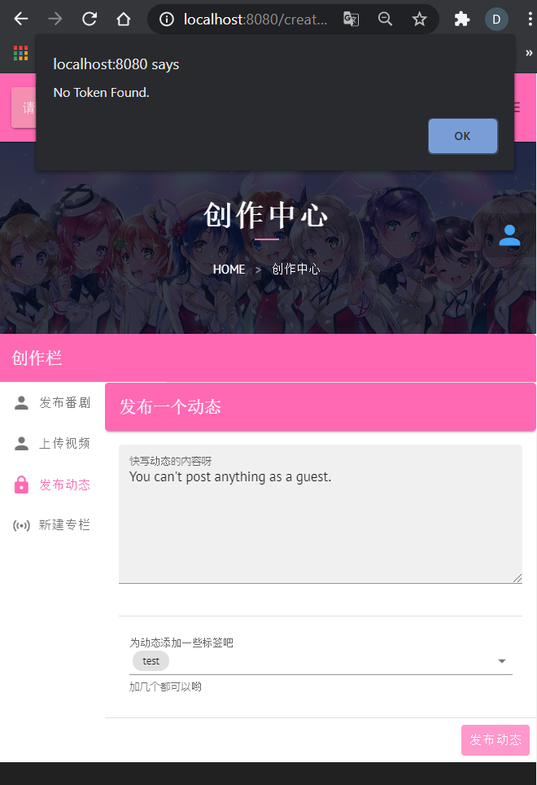

- 用户模式

  此处用户为已登录系统的用户。登录后的用户将拥有更多的权限，除游客模式外的观看阅读权限外，还将拥有上传各种作品的权限，如上传视频、专栏、动态、评论等（除了番剧）。同时还可以与其z他用户进行私信交流，查看自己的收藏，对作品进行点评等等权限。如下图左，用户之间可以互相发送私信；如下图右，用户可以上传视频。

  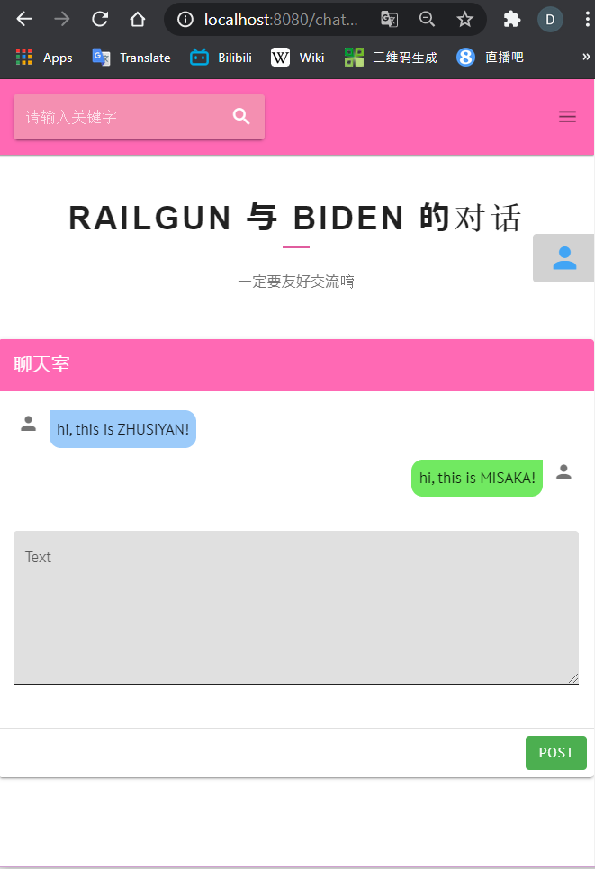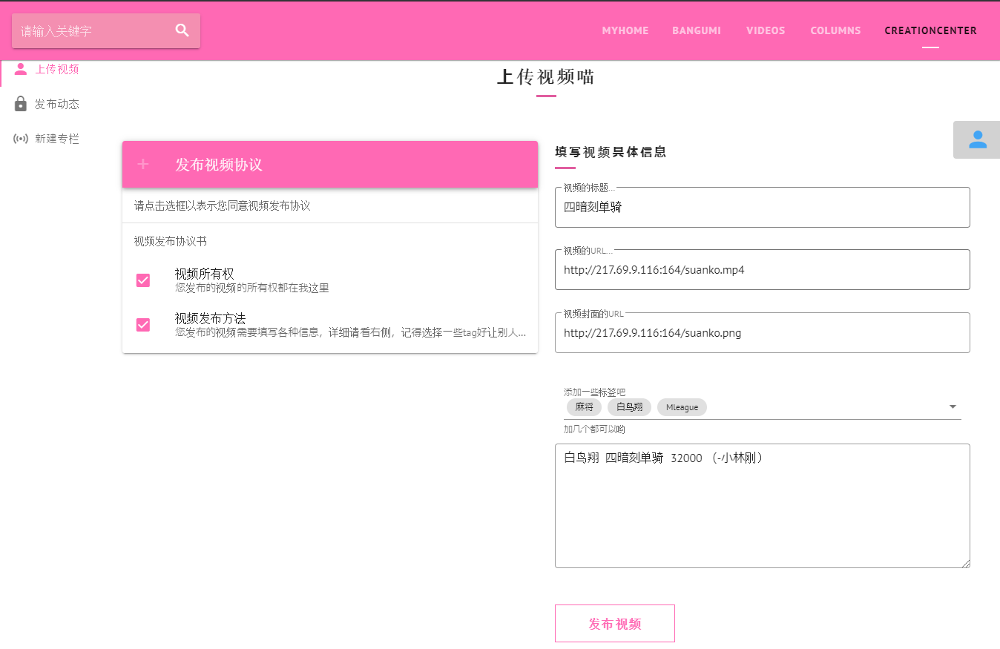

- 管理员模式

  管理员登录后将拥有本系统中的最高权限。管理员在执行管理员管理职责的同时，也同样作为一位用户，即管理员拥有用户所拥有的所有权限。除此之外，管理员拥有在本社区网站上传番剧的权限，且有权力删除社区网站系统中的所有评论、专栏、视频、番剧和动态。至于其前端页面情况与用户大致相同，但会在管理员可删除实体的下方添加一个醒目的删除键以供管理员使用删除权限。

  如下图，管理员可以在BANGUMI / VIDEOS / COLUMNS界面点击`删除`按钮来删除相应的内容。

  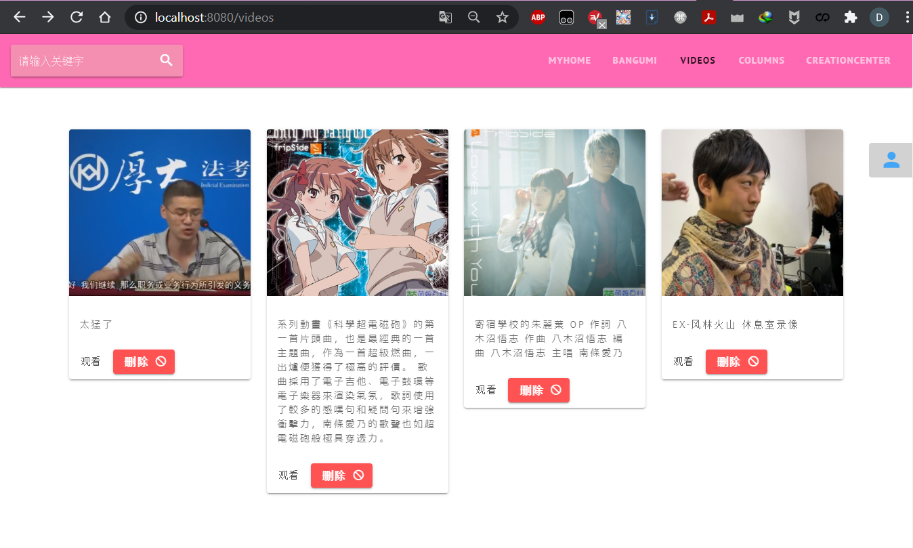

  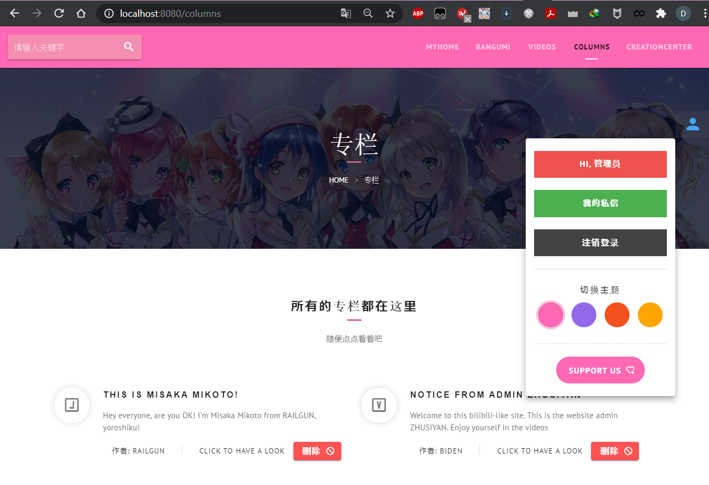


### 4、 管理员权限的授予与分配

如上所述，在本次课程设计的系统中管理员拥有最高的权限，可以任意删除专栏、视频、番剧和动态等实体，它的一些操作会使系统的状态发生巨大改变。因此需要对管理员权限的授予与分配进行严格管理。

首先是关于管理员权限的授予。在本次作业实现的系统中，无论游客、用户还是已注册的管理员，都无法通过前端进行新管理员的注册，即无法通过前端去生成一个新的管理员实体。本作业中的管理员的注册是通过后端，直接使用`SQL`语句对`MySQL`数据库中的管理员信息表进行插入操作完成的。本次课程设计作业通过这种最为简单的方式对管理员权限的授予进行了限制，以保障本次作业设计的社区网站的系统安全性。

对于管理员权限的分配。管理员没有相关权限去进行管理员权限的分配，任何普通用户都无法得到管理员特殊权限中的任何一项。同时也没有任何人可以取消管理员或是用户已拥有的任何一项权限。即当用户或是管理员完成注册后，其权限便已固定不再更改，除非直接在数据库中删除相应的管理员表项。

综上以上的3、4两点，可得出如下的不同类别人员所拥有的权限表格：

| 人员类别/相关权限 | 观看作品 | 上传作品 | 私信    | 收藏    | 点赞    | 上传番剧 | 删除作品 | 赋予权限 |
| ----------------- | -------- | -------- | ------- | ------- | ------- | -------- | -------- | -------- |
| 游客              | $\surd$  |          |         |         |         |          |          |          |
| 已登录用户        | $\surd$  | $\surd$  | $\surd$ | $\surd$ | $\surd$ |          |          |          |
| 管理员            | $\surd$  | $\surd$  | $\surd$ | $\surd$ | $\surd$ | $\surd$  | $\surd$  |          |


## 五、 存储过程、触发器和函数的代码说明

### 1、 存储过程解析

从用户发起一次增删改查的请求开始，到后端收到请求、将该请求转化为对数据库的操作，再到将从数据库得到的信息返回给用户，主要分为以下几步：

1. 用户的浏览器执行由前端服务器定义好的网页脚本，向后端服务器发出一个HTTP请求，其中包含请求参数、请求体、请求头（Token）等信息。
2.  后端的拦截器（Interceptor）拦截到用户发来的请求，执行Token检查：若接下来调用的方法不需要Token，则直接放行该请求；若接下来调用的方法需要Token，则检查Token的有效性以及确认身份，确认成功后在请求中加入身份信息，再将该请求放行。
3. 请求抵达控制器（Controller）层，控制器执行顶层的逻辑判断，并调用服务层提供的相关服务。
4. 服务层（Service）通过调用并组装由数据库访问对象层提供的基本方法，为控制器层提供功能更具体的服务接口。
5. 数据库访问对象层（Database Access Object, DAO）将操作数据库使用的一系列基本的SQL命令封装为Java中可调用的类方法，将关系数据库表中的数据封装为Java中的实体类（Entity）,对数据库执行CRUD，并将得到的结果转化为实体类后返回给服务层。

以下以用户上传视频的请求为例，结合具体代码说明上述流程：

1. 用户进行上传操作，触发浏览器执行网页中的脚本，向服务器指定的的`.../videos/post`发出HTTP POST请求：

   ```javascript
    this.$axios.post('videos/post', {
               videoTitle: this.videoTitle,
               videoUrl: this.videoUrl,
               videoPicUrl: this.videoPicUrl,
               videoDes: this.videoDes,
               newVideoTags: this.newVideoTags,
             }, {
               headers: {
                   token: this.$cookies.get("token")
               }
             })
   ```

2. 后端拦截器拦截到用户请求，由`prehandle`函数执行Token检查：

   ```java
   package com.db2020prj.jwt;
   
   import ...
   
   import javax.servlet.http.HttpServletRequest;
   import javax.servlet.http.HttpServletResponse;
   import java.lang.reflect.Method;
   import java.util.concurrent.SynchronousQueue;
   
   public class AuthInterceptor implements HandlerInterceptor {
       @Autowired
       UserService userService;
   
       @Override
       public boolean preHandle(
               HttpServletRequest httpServletRequest,
               HttpServletResponse httpServletResponse,
               Object object) throws InvalidTokenException {
           // get the token from http request header
           String token = httpServletRequest.getHeader("token");           
           System.out.println(token);
   
           if(!(object instanceof HandlerMethod)) { return true; }
           HandlerMethod handlerMethod = (HandlerMethod) object;  
           Method method = handlerMethod.getMethod(); // the target function this request gonna call
   
           if (method.isAnnotationPresent(PassToken.class)) {  // target function doesn't require a token
               PassToken passToken = method.getAnnotation(PassToken.class);
               if (passToken.required()) {
                   return true;
               }
           }
   
           if (method.isAnnotationPresent(NeedToken.class) ||
               method.isAnnotationPresent(OptionalToken.class) ||
               method.isAnnotationPresent(AsAdmin.class)) {  // target function requires a token
               // start token checking
                   if (null == token || token.equals("null")) { // no token found
                       if (method.isAnnotationPresent(OptionalToken.class)) {
                           return true;
                       }
                       throw new InvalidTokenException("No Token Found.", 300);
                   }
                   int userId;
                   String username;
                   String nickname;
                   boolean isAdmin;
                   try {    // decode the token using the public key to verify identity
                       DecodedJWT decodedJWT = Token.verify(token);
                       userId = decodedJWT.getClaim("userId").asInt();
                       username = decodedJWT.getClaim("username").asString();
                       nickname = decodedJWT.getClaim("nickname").asString();
                       isAdmin = decodedJWT.getClaim("isAdmin").asBoolean();
                       if (method.isAnnotationPresent(AsAdmin.class) && !isAdmin) {
                           // target function requires an Admin authority
                           throw new InvalidTokenException("Must operate as an Administrator!", 500);
                       }
                   } catch (InvalidTokenException e) {
                       if (method.isAnnotationPresent(OptionalToken.class)) {
                           // target function can handle requests both with/without a token
                           return true;
                       }
                       throw e;
                   }
                   RequestWrapper requestWrapper = (RequestWrapper) httpServletRequest;
                   switch (requestWrapper.getMethod()) {
                       // put the user identity into request according to the HTTP request type
                       case "POST" : {
                           String body = requestWrapper.getBody();
                           System.out.println("Request Body: " + body);
                           JSONObject params = JSONObject.parseObject(body);
                           params.put("username", username);
                           params.put("userId", userId);
                           params.put("nickname", nickname);
                           params.put("isAdmin", isAdmin);
                           params.put("token", token);
                           requestWrapper.setBody(JSON.toJSONString(params));
                           break;
                       }
                       case "DELETE" :
                       case "GET" : {
                           requestWrapper.setParam("username", username);
                           requestWrapper.setParam("userId", userId);
                           requestWrapper.setParam("nickname", nickname);
                           requestWrapper.setParam("isAdmin", isAdmin);
                           requestWrapper.setParam("token", token);
                           break;
                       }
                   }
                   return true;
           }
           return true;
       }
   }
   
   ```

3. 对应的Controller收到拦截器拦截并过滤后的请求，执行对应的函数调用。其中，`@PostMapping`指明了该函数对应的POST HTTP请求的url，`@NeedToken`指明了执行该函数前 需要验证用户的Token。控制器最终通过调用`VideoService`类提供的方法`addVideo`完成顶层控制逻辑。

   ```java
   package com.db2020prj.controllers;
   import ...
   
   @RestController
   public class VideoController {
       @CrossOrigin
       @PostMapping(value = "/api/videos/post")  // handles a POST request to url "/api/vidoes/post"
       @NeedToken                                // this function requires user's token to operate
       @ResponseBody                             // return as JSON format
       public Result postVideo(@RequestBody PostVideoRequest request) {
           String videoName = request.getVideoTitle();
           String imageUrl = request.getVideoPicUrl();
           // judge whether post parameters are legal
           if (videoName.length() == 0)
               return new Result(300, "Must have video name!");
           if (videoName.length() > 50)
               return new Result(300, "video name too long!");
           if (imageUrl == null || imageUrl.length() == 0)
               return new Result(300, "must have a cover picture!");
           int userId = request.getUserId();
           User user = userService.getByUserId(userId);
           Image image = imageService.createOrGetImage(request.getVideoPicUrl(), user);
           videoService.addVideo(request, user, image);
           return new Result(200, "video successfully posted!");
       }
   }
   ```

4. `VideoService`类提供`addVideo`方法供控制器调用。该方法首先创建一个新的`Video`实体类实例，设置好各项属性值；最后通过调用DAO层的`VideoDAO`类提供的方法`save`执行将表项插入数据库的SQL语句。类似地，还需要在数据库中加入该视频的标签，该操作通过调用其他服务类`TagService`和`TagRelationService`提供的相应服务完成，此处不再赘述。

   ```java
   package com.db2020prj.service;
   import ...
   
   @Service
   public class VideoService {
       public void addVideo(PostVideoRequest request, User uploader, Image image) {
           Video video = new Video();
           video.setVideoContentUrl(request.getVideoUrl());
           video.setVideoDescription(request.getVideoDes());
           video.setVideoDuration("0.00");
           video.setVideoImage(image);
           video.setVideoName(request.getVideoTitle());
           video.setVideoPlayTimes(0);
           video.setVideoUploader(uploader);
           video.setVideoLikeNumbers(0);
           videoDAO.save(video);            // do SQL insert operation
           List<String> tags = request.getNewVideoTags();
           for (String tagName: tags) {
               Tag theTag = tagService.createOrGetTag(tagName);
               tagRelationService.addRelation(theTag, video);
           }
       }
   }
   ```

5. `VideoDAO`类（接口）通过继承`Spring`框架中的`JpaRepository`接口，由框架负责实现了一系列被封装为Java中可调用函数的SQL命令，例如`save()`对应`INSERT`或`UPDATE`操作，`delete()`对应`DELETE`操作，`findBy***And***(params)`对应`SELECT from ... WHERE *** AND ***`，等等。

   ```java
   package com.db2020prj.dao;
   import com.db2020prj.entities.User;
   import com.db2020prj.entities.Video;
   import org.springframework.data.jpa.repository.JpaRepository;
   import java.util.List;
   
   public interface VideoDAO extends JpaRepository<Video, Integer> {
       List<Video> findByVideoNameLike(String keyword);
   
       List<Video> findAllByVideoUploader(User uploader);
   }
   
   ```

6. DAO层继承的`JpaRepository`将自动完成数据库表项到实体类（Entity）之间的转换。以`Video`实体类为例：

   ```java
   package com.db2020prj.entities;
   import ...
   
   @Entity
   @EntityListeners(AuditingEntityListener.class)
   @Table(name = "video")
   @JsonIgnoreProperties({"handler","hibernateLazyInitializer"})
   public class Video {
       @Id
       @GeneratedValue(strategy = GenerationType.IDENTITY)
       @javax.persistence.Column(name = "video_id")
       int id;
   
       @CreatedDate
       Date videoUploadDate;
       String videoDuration;
       String videoName;
       Integer videoPlayTimes;
       String videoContentUrl;
       String videoDescription;
       Integer videoLikeNumbers;
       
       @ManyToOne
       @JoinColumn(name = "video_image_id")
       Image videoImage;
   
       @ManyToOne
       @JoinColumn(name = "video_uploader_id")
       User videoUploader;
   
       public void setVideoPlayTimes(Integer videoPlayTimes) {  this.videoPlayTimes = videoPlayTimes;  }
   
       public Integer getVideoLikeNumbers() {   return videoLikeNumbers;    }
   
       public void setVideoLikeNumbers(Integer videoLikeNumbers) {
           this.videoLikeNumbers = videoLikeNumbers;
       }
       
   	/******** getters and setters *********/
       public String getVideoDescription() {      return videoDescription;  }
   
       public void setVideoDescription(String videoDescription) {  this.videoDescription = videoDescription; }
   
       public int getId() {     return id;  }
   
       public void setId(int id) {    this.id = id;    }
   
       public Date getVideoUploadDate() {      return videoUploadDate;   }
   
       public void setVideoUploadDate(Date videoUploadDate) {    this.videoUploadDate = videoUploadDate;   }
   
       public String getVideoDuration() {     return videoDuration;   }
   
       public void setVideoDuration(String videoDuration) {    this.videoDuration = videoDuration;   }
   
       public String getVideoName() {      return videoName;   }
       
       public void setVideoName(String videoName) {     this.videoName = videoName;   }
   
       public int getVideoPlayTimes() {     return videoPlayTimes;   }
   
       public void setVideoPlayTimes(int videoPlayTimes) {     this.videoPlayTimes = videoPlayTimes;   }
   
       public String getVideoContentUrl() {      return videoContentUrl;   }
   
       public void setVideoContentUrl(String videoContentUrl) {     this.videoContentUrl = videoContentUrl;  }
   
       public Image getVideoImage() {      return videoImage;   }
   
       public void setVideoImage(Image videoImage) {     this.videoImage = videoImage;   }
   
       public User getVideoUploader() {      return videoUploader;   }
   
       public void setVideoUploader(User videoUploader) {      this.videoUploader = videoUploader;  }
   }
   
   ```

   对应的数据库中的表为：

   ```
   mysql> show columns from video;
   +--------------------+--------------+------+-----+-------------------+-------------------+
   | Field              | Type         | Null | Key | Default           | Extra             |
   +--------------------+--------------+------+-----+-------------------+-------------------+
   | video_id           | int          | NO   | PRI | NULL              | auto_increment    |
   | video_upload_date  | timestamp    | YES  |     | CURRENT_TIMESTAMP | DEFAULT_GENERATED |
   | video_duration     | time         | YES  |     | NULL              |                   |
   | video_name         | varchar(45)  | YES  |     | NULL              |                   |
   | video_play_times   | int          | YES  |     | NULL              |                   |
   | video_content_url  | varchar(512) | YES  |     | NULL              |                   |
   | video_image_id     | int          | YES  | MUL | NULL              |                   |
   | video_uploader_id  | int          | YES  | MUL | NULL              |                   |
   | video_description  | text         | YES  |     | NULL              |                   |
   | video_like_numbers | int          | YES  |     | NULL              |                   |
   +--------------------+--------------+------+-----+-------------------+-------------------+
   10 rows in set (0.01 sec)
   ```

   从用户发出请求到服务器将数据返回给用户，服务器进行处理的整个流程结构示意图如下：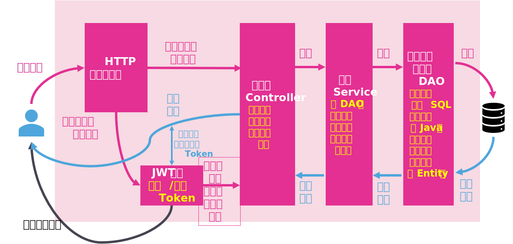

### 2、 触发器

#### a、 简单触发器的使用

如下的五条命令建立的触发器，会在管理员删除番剧表、专栏表、评论表、动态表、视频表中的数据项后进行操作，分别让`xxx_deleted_numbers`与`admin_delete_numbers`加1，以此来统计管理员删除的番剧、专栏、评论、动态、视频数量，以及它们的总和。

```mysql
DROP TRIGGER IF EXISTS `dbprj`.`bangumi_AFTER_DELETE`;

DELIMITER $$
USE `DBprj`$$
CREATE DEFINER = CURRENT_USER TRIGGER `DBprj`.`bangumi_AFTER_DELETE` AFTER DELETE ON `bangumi` FOR EACH ROW
BEGIN
	SET @bangumi_deleted_numbers = @bangumi_deleted_numbers + 1;
    SET @admin_delete_numbers = @admin_delete_numbers + 1;
END$$
DELIMITER ;
```

```mysql
DROP TRIGGER IF EXISTS `DBprj`.`column_AFTER_DELETE`;

DELIMITER $$
USE `DBprj`$$
CREATE DEFINER = CURRENT_USER TRIGGER `DBprj`.`column_AFTER_DELETE` AFTER DELETE ON `column` FOR EACH ROW
BEGIN
	SET @column_deleted_numbers = @column_deleted_numbers + 1;
    SET @admin_delete_numbers = @admin_delete_numbers + 1;
END$$
DELIMITER ;
```

```mysql
DROP TRIGGER IF EXISTS `DBprj`.`comment_AFTER_DELETE`;

DELIMITER $$
USE `DBprj`$$
CREATE DEFINER = CURRENT_USER TRIGGER `DBprj`.`comment_AFTER_DELETE` AFTER DELETE ON `comment` FOR EACH ROW
BEGIN
	SET @comment_deleted_numbers = @comment_deleted_numbers + 1;
    SET @admin_delete_numbers = @admin_delete_numbers + 1;
END$$
DELIMITER ;
```

```mysql
DROP TRIGGER IF EXISTS `DBprj`.`dynamic_AFTER_DELETE`;

DELIMITER $$
USE `DBprj`$$
CREATE DEFINER = CURRENT_USER TRIGGER `DBprj`.`dynamic_AFTER_DELETE` AFTER DELETE ON `dynamic` FOR EACH ROW
BEGIN
	SET @dynamic_deleted_numbers = @dynamic_deleted_numbers + 1;
    SET @admin_delete_numbers = @admin_delete_numbers + 1;
END$$
DELIMITER ;
```

```mysql
DROP TRIGGER IF EXISTS `DBprj`.`video_AFTER_DELETE`;

DELIMITER $$
USE `DBprj`$$
CREATE DEFINER = CURRENT_USER TRIGGER `DBprj`.`video_AFTER_DELETE` AFTER DELETE ON `video` FOR EACH ROW
BEGIN
	SET @video_deleted_numbers = @video_deleted_numbers + 1;
    SET @admin_delete_numbers = @admin_delete_numbers + 1;
END$$
DELIMITER ;
```

以下的六条命令是对变量的初始化，以保证统计数量的正确性。

```mysql
SET @bangumi_deleted_numbers = 0;
SET @column_deleted_numbers = 0;
SET @comment_deleted_numbers = 0;
SET @dynamic_deleted_numbers = 0;
SET @video_deleted_numbers = 0;
SET @admin_delete_numbers = 0;
```

#### b、 复杂触发器的使用

本次作业里没有使用较为复杂的触发器，复杂触发器的工作交由后端处理。例如番剧表中的点赞数属性，当我们在向点赞表中插入对番剧点赞的数据表项后，我们应该增加番剧表中对应番剧的点赞数；删除时同理减少点赞数即可。这份功能既可使用复杂触发器实现，也可以让后端使用高级程序语言实现。

而本次课程设计项目的体量不大，且利用后端进行处理开发难度较小，因此采用了由后端处理复杂触发器的方法。

### 3、 函数

从URL到控制器函数的映射均已注明在项目根目录下的[httpMAPfunction.md](../httpMAPfunction.md)中，由于篇幅过长，此处不再展开。


## 六、 实现过程中的主要技术论述

### 1. MVC模式开发

MVC模式是一种软件系统开发的架构。MVC将一个系统分为三部分：模型（Model）、视图（View）和控制器（Controller）。借助MVC模式开发，可以将系统的各部分分离，使得程序结构更为直观，整个系统开发的分工更为明确。

在本系统中，可以按照MVC模式将整个数据库系统分为三个部分：

- M：模型

  即通过建立MySQL关系型数据库，对实体概念抽象成模型，以关系数据表的形式存储在数据库中；以及在后端服务器中将数据库中的每张表转化为对应的实体类，也是对于实体概念建立的模型。

- V：视图

  即用户通过浏览器看到的网页，包括网页的布局和其中包含的数据内容。该部分由前端设计实现，即使用`Vuetify`框架和`Vue.js`搭建前端服务器，给用户返回页面格式和脚本。

- C：控制器

  即后端服务器对用户发来的请求进行处理，并根据请求对数据库进行CRUD；控制器充当了用户和数据库之间转发请求和数据的角色。该部分由后端设计实现，即使用`SpringBoot`框架和`Java`搭建后端服务器，接收用户请求并调用数据库。

该结构如下图所示。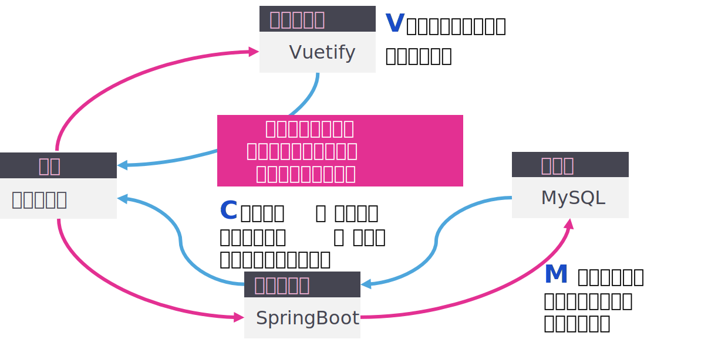

 ### 2. 版本控制

由于进行团队开发，每个人的分工不同，且需要进行前后端结合的调试，因此需要版本控制工具，便于保持各个成员开发环境中代码的一致性。

本次系统开发使用了分布式内容分管理系统`Git`作为版本控制工具，使用`Github`搭建本项目的远程仓库。本项目在`Github`上的url为：[https://github.com/mikejolno/database2020fall](https://github.com/mikejolno/database2020fall)（目前为非公开仓库）。

### 3. REST风格的Web服务架构

REST即**Re**presentational **S**tate **T**ransfer，这种设计允许客户端对URI发出资源请求，并通过XML, HTML或JSON来传递资源。REST的设计用URI统一了服务的接口，实现了无状态的服务，且便于客户端和服务端分离，提高前端和后端的复用性。

在本系统中，客户端（浏览器）执行JavaScript中的`axios`函数，向后端服务器发出HTTP请求；服务端准备好数据后，通过对控制器方法进行`@ResponseBody`的标注，将给用户返回的数据转化为JSON的形式。这一过程是无状态的，即服务器不需要记录用户的状态，而是借助JWT来确认用户的身份。

### 4. 基于Nginx的图片服务器

为了提高本数据库系统的实用性，需要使用图片服务器存储用户需要分享的图片和视频。因此，同样在远程的`Linux Ubuntu`服务器上部署了`Nginx`图片服务器，提供了图片和视频资源的URL解析服务。服务器中存储图片的目录为` /home/public/images/`；服务器对外提供的用于获取相应资源的URL为`http://217.69.9.116:164/images/`。

例如，目前服务器的图片目录下有如下文件：

```shell
root@FR_highFreq:/home/public/images# ls
01kiseki.mp4        ex_frks.png           lovewithyou.png  omr.png
01kiseki.png        finalphase.mp4        luoxiang.mp4     pxpII_1.png
3.png               finalphase.png        luoxiang.png     pxpII_2.png
coffee.mp4          herewego.mp4          mabaoguo.mp4     signin.mp4
coffee.png          herewego.png          mabaoguo.png     suanko.mp4
decade.mp4          jks.jpg               nanjolno.jpg     suanko.png
decade.png          lovestudy.png         nozoeli.jpg      video.mp4
eternalreality.mp4  lovesutdy.mp4         okada.png        yagi.png
eternalreality.png  lovewithyoucover.jpg  omrcover.jpg     yzksp2.mp4
ex_frks.mp4         lovewithyou.mp4       omr.mp4
```

如要访问其中的`finalphase.png`图片，则只需使用url`http://217.69.9.116:164/images/finalphase.png`，即可得到如下图片：


获取其中的视频同理，但需要有可以解析URL的视频播放器，此处不再赘述。本项目中，前端使用了`vue-video-player`插件来在网页中播放URL对应的视频。

## 七、 若干展示系统功能的运行实例 

- 注册页面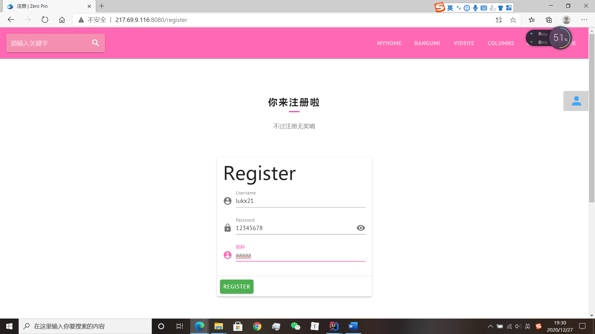

- 登录页面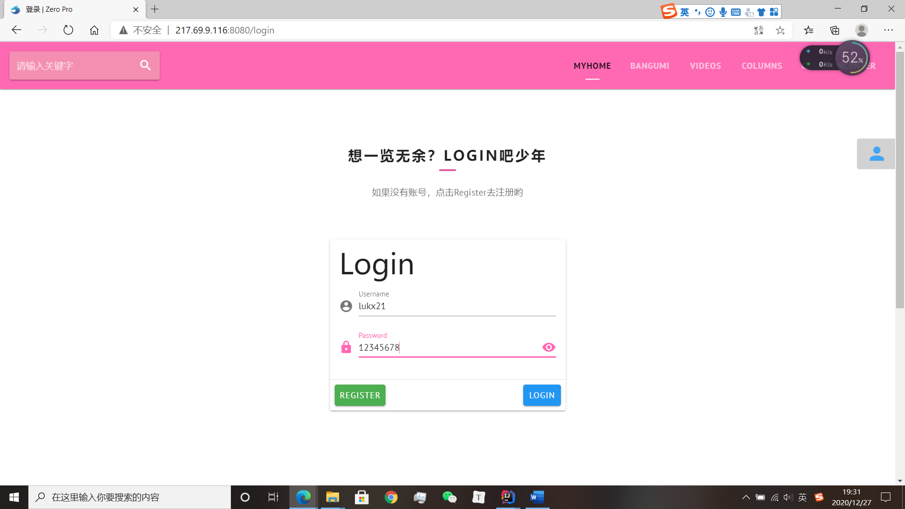
- 根据关键词搜索内容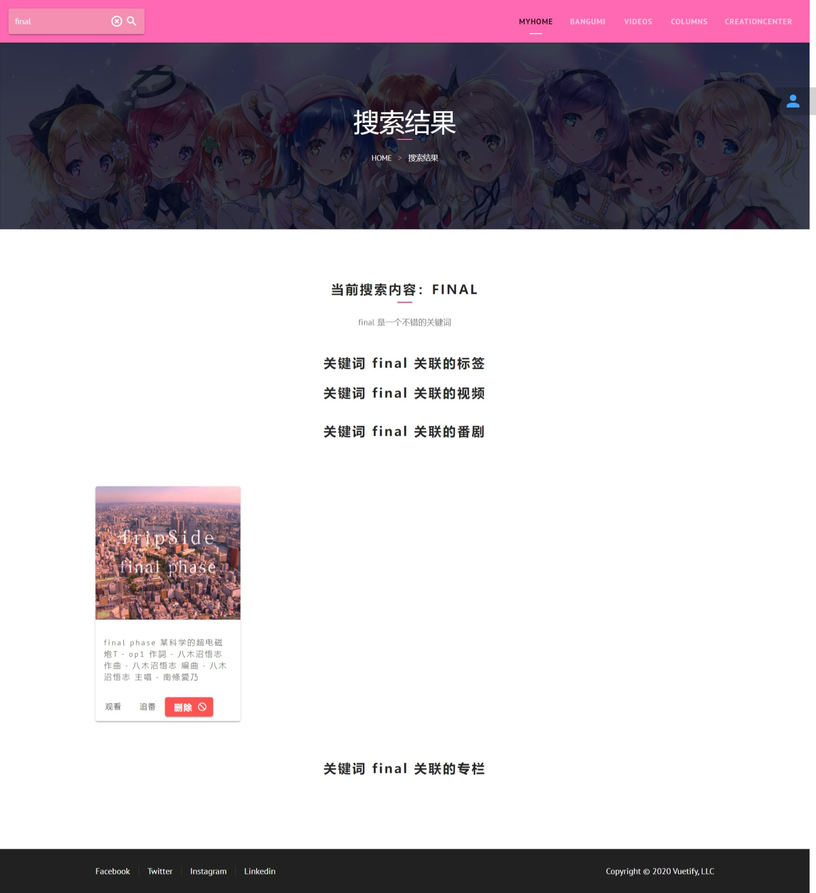
- 主页内容
- 视频观看页面
- 视频上传页面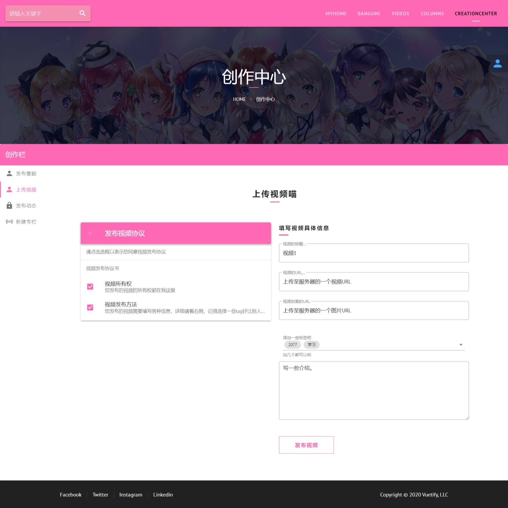

更多运行图片可见当前目录下的[running_images](./running_images)目录。


## 八、 源程序简要说明

### 前端代码

前端代码的根目录为`my_theme/`。

项目的全局配置主要位于`/main.js`，包括插件的引入、全局变量和参数的定义等。如将`axios`的默认baseURL设置为后端指定的`localhost:8097/api`。

页内路由的声明主要位于`/src/router/index.js`，即决定了跳转到哪个页面。

对每个页面的配置位于`/src/views/`，其中的每个文件夹中都有一个`index.vue`文件，即为该页面的配置，包括使用的插件、页面的属性等。

每个页面内容及脚本的定义位于`/src/views/sections/`，其中有若干`.vue`文件，用`vue`编写了每个页面的HTML格式、内容以及预置的脚本。

### 后端代码

后端项目的根目录为`demo/`，对项目的全局配置主要位于`/pom.xml`，该文件用XML声明了了项目运行所需要的环境以及依赖的所有包。对项目的配置主要位于`/src/main/resources/application.properties`，其中定义了数据库的位置、访问数据库使用的用户名和密码、调试过程中是否输出SQL语句等等。

Java代码的根目录为`demo/src/main/java/`。其中：

- `com.db2020prj.controllers`包中定义了所有前端控制器类及其被URL映射的方法，以及定义了用于辅助传参数以及返回值的`request`包和`result`包。
- `com.db2020prj.service`包中定义了所有服务类，用于整合DAO类提供的方法，共控制器调用。
- `com.db2020prj.dao`包中定义了对象访问对象接口，用于将访问数据库的SQL语句封装为服务类可调用的方法。
- `com.db2020prj.entities`包中定义了所有实体类，用于将数据库中的表项转化为Java中可访问的类。
- `com.db2020prj.jwt`包中实现了JWT所需的一切类和函数。


## 九、 收获和体会

在完成本次课程实验的项目后，我们小组中的所有人都受益匪浅，有了很多的收获与体会。

### 1、 对数据库课程相关知识的加深理解

在实现本次课程设计作业时，我们需要构思一定量的实体型以及它们之间的关系，画出对应的逻辑模型ER图，并以此为依据创建数据库中的基本表。而在创建基本表的过程中，我们又对外键约束、索引表项、触发器使用等课程内容加深了印象。最后根据课程中所学的3NF的相关定义，优化了基本表的结构，使其更易操作。

在这一系列的过程中，我们再一次温习了我们在数据库理论课程中所学到的知识，并将它们从书本搬到了实际中，让原本抽象的概念变得更加具体、深刻。

### 2、 实践与理论的区别

书本上的知识终究是书本上的，要做到真正掌握还是必须通过实践。实践出真知，只有一步一步地设计、一步一步地实现，在此之后我们才能真正地了解其内涵意义，才能真正地掌握这份知识。

数据库的设计看似简单，只是需要一堆的创建表命令。但实际上表属性的设计、表与表之间的联系、甚至是表与表属性的命名都需要经过深思熟虑，否则与后端的信息交互也会受到影响。

后端的开发也绝不是简单的事情，其既要与前端设计人员进行合作开发、交流信息传递，还要了解底层的数据库结构，并与之进行交互。要熟悉数据库操作，对数据库进行增删改查；要了解前端需求，并以此设计大量接口。并且整体工作繁杂，需要实现大量功能。

至于前端的开发，可能比后端还有复杂一些。完成前端开发需要掌握`HTML`、`CSS`以及`JavaScript`等语言，并属性一定量的js框架。同时需要与后端开发合作，还要与需求分析人员交流完成交互设计，设计网页的架构。

### 3、 对项目开发的一些体会

项目开发需要小组成员之间的合作。前后端之间需要设置大量的接口进行交互，这需要前后端开发人员之间的密切交流，以分析接口需求。后端与数据库之间也同样需要相互合作，使系统功能更加完备，并在此基础上追求一定的性能。

项目开发还需要小组成员在某些方面达成一定的共识。例如前后端之间的交互需要使用大量的接口，而整个项目的开发过程中，前后端之间的开发进度通常是不统一，因此需要预先设计好接口的命名参数等性质，以供二者更好地合作开发。

项目开发可以使用一定的基础框架。在无框架情况下直接开始开发项目难度大，且容易在项目开发后期导致结构上的混乱。因此可以在开始项目前，对项目需求进行分析处理，选择合适的项目框架。

### 4、 新的语言、框架的掌握

在完成本次课程设计作业的过程中，我们使用到了`java`、`HTML`、`JavaScript`、`CSS`、`SQL`等语言和技术，了解了`Vuetify`与`SpringBoot`等应用框架，对项目开发也有了更加深刻的理解。

### 5、 时间的管理安排

时间的管理安排是任何项目开发中永恒的主题，但我们小组在这一方面完成地并不理想。总体而言，本次课程设计作业的工作量是相当大的，但是我们并没有合理地安排时间，导致我们小组在后期时间里异常繁忙。这是我们需要改进的地方，我们应该在项目开始阶段便制定好项目管理的时间表，确定每周的任务，催促自己快速完成计划目标。这样在项目开发后期也可以在时间上给予自己更多喘息的机会，甚至还可以利用这些时间对项目进行性能上的优化。


## 十、 结束

以上即为本小组数据库理论课程设计——系统实现总结报告的全部内容。